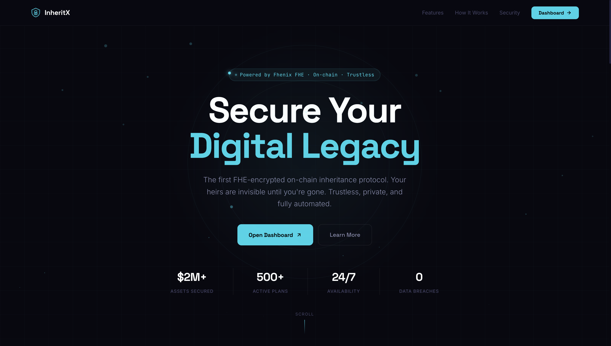

<p align="center">
  
</p>

<h1 align="center">InheritX</h1>

<p align="center">
  <strong>The first FHE-encrypted on-chain inheritance protocol.</strong><br/>
  Your heirs are invisible until you're gone.
</p>

<p align="center">
  <a href="https://github.com/martinvibes/InheritX-Zama">GitHub</a> · <a href="#the-problems">Problems</a> · <a href="#our-solutions">Solutions</a> · <a href="#use-cases">Use Cases</a> · <a href="#how-it-works">How It Works</a> · <a href="#tech-stack">Tech Stack</a> · <a href="#getting-started">Getting Started</a>
</p>

<p align="center">
  
</p>

---

## The Problems

### $140B+ in Crypto Lost Forever
An estimated **$140 billion** in cryptocurrency is permanently inaccessible because owners died without passing on their private keys. Their families had no way to recover the funds. This number grows every year.

### Transparent Blockchains Expose Your Heirs
On regular Ethereum, if you store your heir's wallet address in a smart contract, **block explorers can see it instantly**. Your heir becomes a target for phishing, social engineering, and MEV attacks — before they even know they've inherited anything.

### Existing Solutions All Fail

| Approach | Why It Fails |
|----------|-------------|
| **Commit-reveal** | The "reveal" transaction is visible in the mempool. MEV bots front-run it before it lands on-chain. |
| **Multisig wallets** | Requires trusting multiple key holders who can collude, lose keys, or become unreachable. |
| **Centralized platforms** | Companies go offline, get hacked, freeze accounts, or shut down — taking your plan with them. |
| **Paper wills** | No on-chain enforcement. Relies on lawyers, courts, and probate — slow, expensive, and bypassable. |
| **Shared seed phrases** | Whoever has the phrase has the funds immediately. No time-lock, no conditions, no privacy. |

**Every existing solution either leaks your heir's identity or requires trusting a third party.**

---

## Our Solutions

InheritX solves every problem above with **Fully Homomorphic Encryption (FHE)** via Zama's fhEVM.

### Encrypted Heir Addresses
Heir wallet addresses are stored as `eaddress` ciphertext on-chain. Block explorers, validators, and even the contract itself **cannot read who your heirs are**. This is mathematically guaranteed — not hidden behind access controls.

### Zero Front-Running Risk
There is no "reveal transaction" to intercept. Decryption happens inside the Zama KMS threshold network — a distributed system where no single party can decrypt alone. MEV bots have nothing to front-run.

### Fully Decentralized & Non-Custodial
No company, no server, no trusted third party. The smart contract IS the inheritance plan. It executes automatically, provably, and **cannot be stopped, frozen, or censored by anyone**. Your assets stay in the contract — not in someone else's wallet.

### Automated Dead-Man's Switch
Set a check-in window (2 minutes to 1 year). If you stop proving you're alive, the plan triggers automatically. No lawyers, no courts, no probate. Just code executing as programmed.

### Encrypted Multi-Heir Splits
Distribute assets across multiple heirs with encrypted percentage splits (`euint32`). Nobody — not even the heirs themselves — can see who gets what until the plan triggers.

### Owner-Controlled Decryption
The plan owner can decrypt and view their own locked ETH amount at any time via wallet signature (EIP-712). Heirs gain view access only after claiming. Everyone else sees encrypted ciphertext on Etherscan.

---

## Use Cases

### 1. Family Inheritance
A crypto holder creates an Inheritance Plan with a 180-day check-in window. Their spouse and children are designated as heirs with encrypted addresses and split percentages. If the owner passes away and stops checking in, the family can claim their share — without ever being visible as beneficiaries on-chain.

### 2. College Fund
A parent locks 2 ETH in a Future Goal Plan set to unlock on their daughter's 18th birthday. The funds are time-locked and the amount is encrypted — nobody can touch them early, and the daughter claims when the date arrives.

### 3. Business Succession
A DAO founder designates a co-founder as successor for treasury access. If the founder becomes inactive for 90 days, the co-founder can claim operational funds — ensuring business continuity without exposing the succession plan publicly.

### 4. Charitable Giving
An anonymous donor wants to leave crypto to a charity after their death. They create an Inheritance Plan with the charity's wallet as beneficiary. The donation is invisible until triggered — anonymous giving with on-chain enforcement.

### 5. Emergency Dead-Man's Switch
A journalist or activist in a high-risk environment creates a plan with a 7-day check-in. If they're detained or harmed and can't check in, encrypted information and funds are released to designated contacts automatically.

### 6. Milestone Rewards
A parent sets up multiple Future Goal Plans — one unlocking at graduation, another at first job, another at marriage. Each milestone releases funds automatically on the set date. Private, automatic, unstoppable.

---

## How It Works

```
1. Connect Wallet    →  Link MetaMask, WalletConnect, or any Web3 wallet
2. Verify Identity   →  One-click KYC verification on-chain
3. Create a Plan     →  Add heirs, set trigger, lock ETH — all encrypted via fhEVM
4. Stay Alive        →  Check in periodically to reset your timer
5. If you stop...    →  Plan triggers → Heirs claim → ETH transferred
```

### Under the Hood

**When you add a beneficiary:**
```
Plaintext address:   0x4a2B...c8E9
         ↓ encrypted via Zama fhEVM
On-chain storage:    0x8f3a...████████  (unreadable ciphertext)
Verification hash:   keccak256(address) → stored for claim verification
```

**When the plan triggers:**
```
Inactivity window expires
         ↓
Anyone calls trigger() → plan marked as triggered
         ↓
Heir connects wallet → keccak256(msg.sender) verified against stored hash
         ↓
ETH share transferred directly to heir's wallet
```

---

## Why FHE?

| | Without FHE | With InheritX |
|---|---|---|
| **Heir address** | Visible on Etherscan | Encrypted as `eaddress` |
| **ETH amount** | Public in tx value | Encrypted as `euint128` |
| **Share splits** | Readable in calldata | Encrypted as `euint32` |
| **Claim process** | Front-runnable via MEV | Hash-verified, no mempool exposure |
| **Trust model** | Requires trusted party | Trustless — math only |
| **Heir safety** | Heir is a public target | Heir is completely invisible |

**FHE (Fully Homomorphic Encryption)** allows computation on encrypted data without ever decrypting it. Zama's fhEVM brings this to the EVM — meaning InheritX can verify conditions and execute logic on encrypted values without ever seeing the plaintext.

---

## Features

| Feature | Description |
|---------|-------------|
| **Privacy by Default** | Heir addresses stored as `eaddress` — invisible on-chain |
| **Dead-Man's Switch** | Configurable check-in windows from 2 minutes to 1 year |
| **Multi-Heir Splits** | Encrypted percentage distribution across multiple beneficiaries |
| **Two Plan Types** | Inheritance (inactivity trigger) + Future Goal (date trigger) |
| **Encrypted Vault** | Store seed phrases and private messages as `euint128` chunks |
| **KYC-Gated** | Identity verification required for plan creation |
| **Owner Decryption** | View your own locked ETH via wallet signature (EIP-712) |
| **Heir Verification** | `keccak256` hash matching — only real heirs can claim |
| **Non-Custodial** | No admin access, no freeze function, no backdoors |
| **On-Chain Activity** | Real event tracking — plan creation, check-ins, claims |

---

## Tech Stack

### Smart Contracts
| | |
|---|---|
| **Language** | Solidity 0.8.24 |
| **FHE Library** | `@fhevm/solidity` ^0.11.1 |
| **FHE Types** | `eaddress`, `euint128`, `euint64`, `euint32`, `ebool` |
| **Framework** | Hardhat + `@fhevm/hardhat-plugin` |
| **Network** | Ethereum Sepolia (chainId: 11155111) |

### Frontend
| | |
|---|---|
| **Framework** | React 19 + Vite + TypeScript |
| **Web3** | wagmi v2, viem, RainbowKit |
| **FHE Client** | `@zama-fhe/relayer-sdk` v0.4.1 |
| **Animations** | Framer Motion |
| **Icons** | Lucide React |

---

## Project Structure

```
InheritX-Zama/
├── contract/                    # Smart contracts
│   ├── contracts/
│   │   └── InheritX.sol         # Core contract with FHE
│   ├── scripts/
│   │   └── deploy.ts            # Deployment script
│   ├── test/                    # Test suite
│   └── hardhat.config.ts
├── frontend/                    # React application
│   ├── public/
│   │   ├── wasm/                # fhEVM WASM files
│   │   ├── logo.svg
│   │   └── favicon.svg
│   └── src/
│       ├── pages/               # Landing, Dashboard, Docs, etc.
│       ├── components/          # Layout, Dashboard, shared
│       ├── hooks/               # useKYC, usePlans, useCheckIn
│       ├── lib/                 # fhe.ts, contracts.ts, wagmi.ts
│       └── styles/              # globals.css, dashboard.css
└── README.md
```

---

## Getting Started

### Prerequisites
- Node.js 20+
- npm
- MetaMask or any Web3 wallet
- Sepolia ETH ([faucet](https://sepoliafaucet.com))

### Run the Frontend

```bash
cd frontend
npm install
npm run dev
```

Opens at `http://localhost:5173`

### Deploy Contracts

```bash
cd contract
npm install
cp .env.example .env
# Add your PRIVATE_KEY and SEPOLIA_RPC_URL
npx hardhat compile
npx hardhat run scripts/deploy.ts --network sepolia
```

### Environment Variables

**Frontend** (`frontend/.env`):
```env
VITE_CONTRACT_ADDRESS=0x...deployed_address
VITE_CHAIN_ID=11155111
VITE_WALLETCONNECT_PROJECT_ID=your_project_id
VITE_FHEVM_NETWORK_URL=https://sepolia.infura.io/v3/your_key
VITE_FHEVM_GATEWAY_URL=https://gateway.zama.ai
```

**Contract** (`contract/.env`):
```env
PRIVATE_KEY=your_deployer_private_key
SEPOLIA_RPC_URL=https://sepolia.infura.io/v3/your_key
```

---

## Demo Flow

1. **Landing page** → See what InheritX does and why it matters
2. **Connect wallet** → One click via RainbowKit
3. **Complete KYC** → Single transaction, auto-verified on testnet
4. **Create a plan** → Name, description, heir addresses, trigger window, lock ETH
5. **Watch encryption** → Data encrypted via fhEVM before on-chain storage
6. **Check in** → "I'm Alive" button resets the timer
7. **Wait for trigger** → Timer expires → "Trigger Plan" button appears
8. **Trigger** → Anyone can trigger → plan marked for claiming
9. **Switch to heir wallet** → Go to Claim Inheritance page
10. **Claim** → Contract verifies heir hash → ETH sent to heir's wallet

---

## Security Model

- **FHE Encryption** — All heir data encrypted as `eaddress`/`euint128`/`euint32` via Zama fhEVM
- **Hash Verification** — `keccak256(heirAddress)` stored at creation, verified at claim
- **ACL Enforcement** — `FHE.allowThis()` called after every FHE operation
- **Non-Custodial** — No admin withdraw, no pause function, no backdoors
- **Per-Beneficiary Claims** — Each heir claims individually, tracked via `beneficiaryClaimed` mapping
- **Threshold Decryption** — Zama KMS network — no single party can decrypt
- **Plaintext by Design** — Only `lastCheckin` timestamp and plan metadata are public

---

## Roadmap

| Phase | Milestone |
|-------|-----------|
| **Phase 1** ✅ | Landing, Dashboard, Core contract, KYC, Inheritance plans, Check-in, Trigger, Claim |
| **Phase 2** | Future Goal plans (time-lock), Real KYC integration, Encrypted vault messages |
| **Phase 3** | EncryptedERC20 support, Multi-token inheritance, Activity notifications |
| **Phase 4** | Chainlink Keepers for auto-trigger, ENS resolution, Email reminders |
| **Phase 5** | Mainnet deployment, Legal framework, Audit, Referral system |

---

## Built With

- [Zama fhEVM](https://www.zama.org/) — Fully Homomorphic Encryption for smart contracts
- [Ethereum Sepolia](https://sepolia.etherscan.io/) — Testnet deployment
- [React](https://react.dev/) + [Vite](https://vitejs.dev/) — Frontend
- [wagmi](https://wagmi.sh/) + [RainbowKit](https://www.rainbowkit.com/) — Wallet connection
- [Framer Motion](https://www.framer.com/motion/) — Animations
- [Lucide](https://lucide.dev/) — Icons

---

## Links

- **GitHub**: [github.com/martinvibes/InheritX-Zama](https://github.com/martinvibes/InheritX-Zama)
- **Docs**: `/docs` route in the app
- **Contract**: Deployed on Ethereum Sepolia

---

<p align="center">
  <strong>InheritX</strong> — Secure Your Digital Legacy<br/>
  <sub>Built on Zama fhEVM · Deployed on Ethereum Sepolia · PL Genesis Hackathon</sub>
</p>
